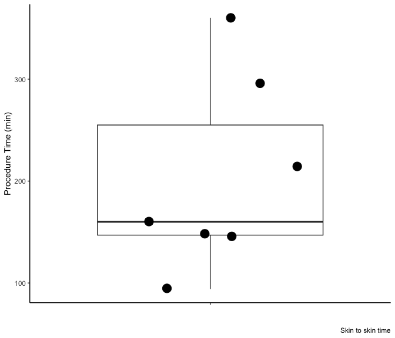
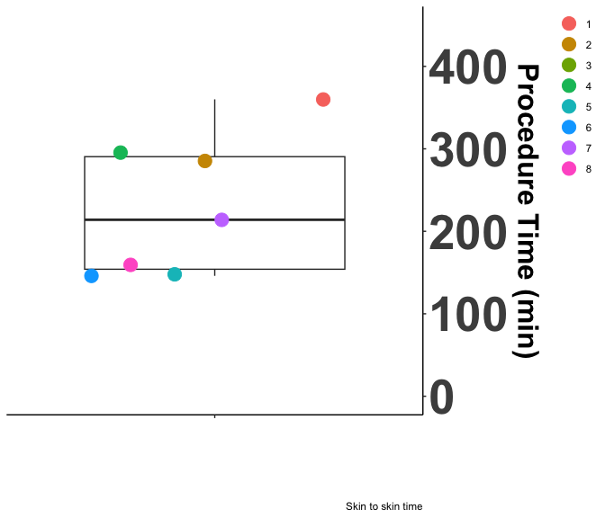
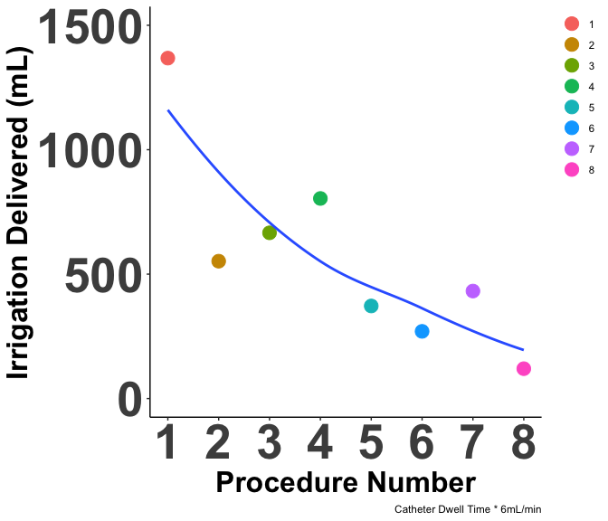
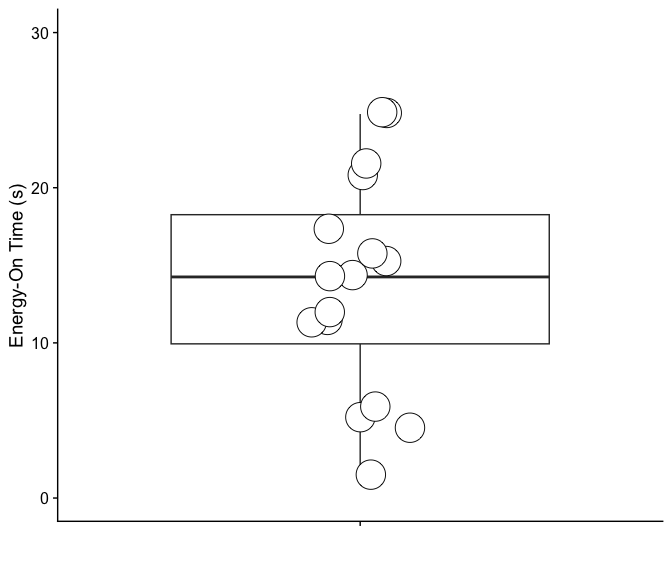
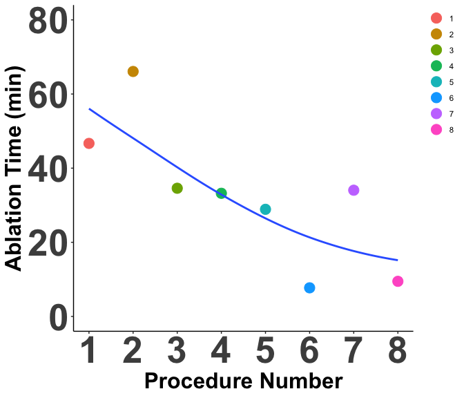
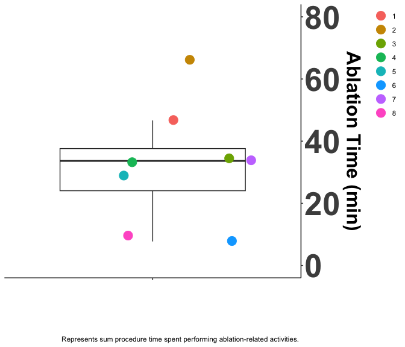

# Start with a clean slate


# Import - Point to the correct raw data directory


# Aesthetics


## load Subject Data


# Descriptive Statistics

Analysis Plan:
- histoplots of continuous variables - as of 7/30/24 this was useless to do, shows nothing at all due to small sample
- loess plots of continuous variables; x-axis is each procedure aligned in termporal order
- box plots
- we do procedure time vs rove time "proc_vs_rove" 

Hypotheses:

1) rove_per_app and rove_vs_proc with x axis as patient number to hopefully show a decreasing trend for both; i.e., you can 
  do lots of applications in a short period of time & ablation time is small relative to procedure time as the physician
  becomes more comfortable with our system
  
## The numbers

<div class="kable-table">

| mean_proc_min| sd_proc_min| mean_abl_min| sd_abl_min| mean_irrigation| sd_irrigation|
|-------------:|-----------:|------------:|----------:|---------------:|-------------:|
|      229.8571|    84.86937|      32.5875|   18.87275|             573|      387.6257|

</div>


### Make Mapping Data

Make temporary mapping data.


## Procedure Time

#### Line Plot

<!-- -->

#### Box Plots

<!-- -->
## Irrigation Delivered

#### Line Plot

<!-- -->

#### Box Plots

<!-- -->

## Ablation Time

#### Line Plot

<!-- -->

#### Box Plots

<!-- -->

# Save Results

# Version and Package Details


```
## [1] "R version 4.4.0 (2024-04-24) Puppy Cup"
```

```
## [1] "RStudio Version 2024.4.2.764 Chocolate Cosmos"
```

<div class="kable-table">

|        |package |loadedversion |
|:-------|:-------|:-------------|
|dplyr   |dplyr   |1.1.4         |
|ggplot2 |ggplot2 |3.5.1         |

</div>

# Detach Packages before moving on


# When were these files last rewritten?


```
## [1] "Sun Sep 22 09:41:22 2024"
```
