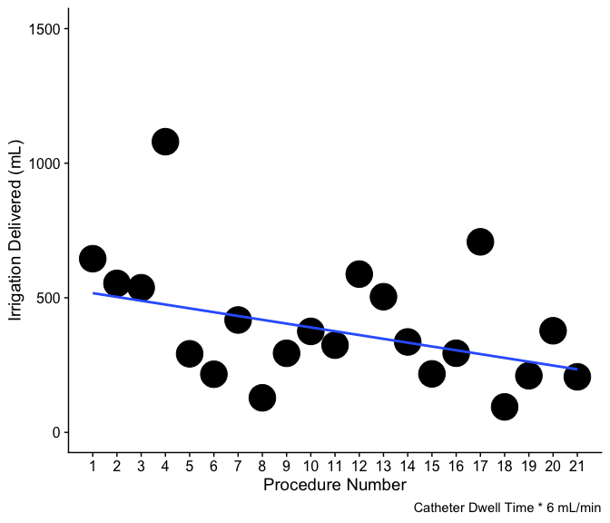

# Import - Point to the correct raw data directory


``` r
raw_data_dir <-"data/processed/working_efficiency_stats.RData"
```

# Aesthetics


``` r
blank.plot <- theme_bw() +
  theme(panel.border = element_blank(), 
        panel.grid.major = element_blank(), #this theme section generates a blank canvas
        panel.grid.minor = element_blank(), 
        axis.line = element_line(colour = "black"),
        legend.title = element_blank(),
        legend.justification="top")
```

## load Subject Data

``` r
load(raw_data_dir)
```

# Descriptive Statistics

Analysis Plan:
- histoplots of continuous variables - as of 7/30/24 this was useless to do, shows nothing at all due to small sample
- loess plots of continuous variables; x-axis is each procedure aligned in termporal order
- box plots
- we do procedure time vs rove time "proc_vs_rove" 

Hypotheses:

1) rove_per_app and rove_vs_proc with x axis as patient number to hopefully show a decreasing trend for both; i.e., you can 
  do lots of applications in a short period of time & ablation time is small relative to procedure time as the physician
  becomes more comfortable with our system

### Make Mapping Data

Make temporary mapping data.


``` r
# Make a procedure number column which is the patient id's numbered sequentially
temp_map_dat <- cleaned_res |>
  mutate(proc_num = seq_along(id))
```

## Procedure Time

#### Line Plot


``` r
ggplot(data = temp_map_dat, aes(x = proc_num, y = procedure_time_min)) +
  geom_point() +
  geom_smooth() +
  scale_x_continuous(labels = temp_map_dat$proc_num, breaks = temp_map_dat$proc_num) +
  coord_cartesian(ylim = c(0,max(temp_map_dat$procedure_time_min) + 30)) + 
  xlab("Procedure Number") +
  ylab("Procedure Time (min)") +
  labs(caption = "Skin to skin time") +
  blank.plot
```

```
## `geom_smooth()` using method = 'loess' and formula = 'y ~ x'
```

```
## Warning: Removed 2 rows containing non-finite outside the scale range
## (`stat_smooth()`).
```

```
## Warning in simpleLoess(y, x, w, span, degree = degree, parametric = parametric,
## : span too small.  fewer data values than degrees of freedom.
```

```
## Warning in simpleLoess(y, x, w, span, degree = degree, parametric = parametric,
## : pseudoinverse used at 0.97
```

```
## Warning in simpleLoess(y, x, w, span, degree = degree, parametric = parametric,
## : neighborhood radius 3.03
```

```
## Warning in simpleLoess(y, x, w, span, degree = degree, parametric = parametric,
## : reciprocal condition number 0
```

```
## Warning in simpleLoess(y, x, w, span, degree = degree, parametric = parametric,
## : There are other near singularities as well. 9.1809
```

```
## Warning in simpleLoess(y, x, w, span, degree = degree, parametric = parametric,
## : Chernobyl! trL>n 5
## Warning in simpleLoess(y, x, w, span, degree = degree, parametric = parametric,
## : Chernobyl! trL>n 5
```

```
## Warning in sqrt(sum.squares/one.delta): NaNs produced
```

```
## Warning in predLoess(object$y, object$x, newx = if (is.null(newdata)) object$x
## else if (is.data.frame(newdata))
## as.matrix(model.frame(delete.response(terms(object)), : span too small.  fewer
## data values than degrees of freedom.
```

```
## Warning in predLoess(object$y, object$x, newx = if (is.null(newdata)) object$x
## else if (is.data.frame(newdata))
## as.matrix(model.frame(delete.response(terms(object)), : pseudoinverse used at
## 0.97
```

```
## Warning in predLoess(object$y, object$x, newx = if (is.null(newdata)) object$x
## else if (is.data.frame(newdata))
## as.matrix(model.frame(delete.response(terms(object)), : neighborhood radius
## 3.03
```

```
## Warning in predLoess(object$y, object$x, newx = if (is.null(newdata)) object$x
## else if (is.data.frame(newdata))
## as.matrix(model.frame(delete.response(terms(object)), : reciprocal condition
## number 0
```

```
## Warning in predLoess(object$y, object$x, newx = if (is.null(newdata)) object$x
## else if (is.data.frame(newdata))
## as.matrix(model.frame(delete.response(terms(object)), : There are other near
## singularities as well. 9.1809
```

```
## Warning in stats::qt(level/2 + 0.5, pred$df): NaNs produced
```

```
## Warning: Removed 2 rows containing missing values or values outside the scale range
## (`geom_point()`).
```

```
## Warning in max(ids, na.rm = TRUE): no non-missing arguments to max; returning
## -Inf
```

<!-- -->

#### Box Plots


``` r
ggplot(data = temp_map_dat, aes(x = "", y = procedure_time_min)) +
  geom_boxplot() +
  geom_jitter(size = 5) + 
  xlab("") +
  ylab("Procedure Time (min)") +
  labs(caption = "Skin to skin time") +
  blank.plot
```

```
## Warning: Removed 2 rows containing non-finite outside the scale range
## (`stat_boxplot()`).
```

```
## Warning: Removed 2 rows containing missing values or values outside the scale range
## (`geom_point()`).
```

<!-- -->

## Rove Time

#### Line Plot


``` r
ggplot(data = temp_map_dat, aes(x = proc_num, y = rove_time_min)) +
  geom_point() +
  geom_smooth() +
  scale_x_continuous(labels = temp_map_dat$proc_num, breaks = temp_map_dat$proc_num) +
  coord_cartesian(ylim = c(0,max(temp_map_dat$rove_time_min) + 30)) + 
  xlab("Procedure Number") +
  ylab("Catheter Rove Time (min)") +
  blank.plot
```

```
## `geom_smooth()` using method = 'loess' and formula = 'y ~ x'
```

```
## Warning: Removed 2 rows containing non-finite outside the scale range
## (`stat_smooth()`).
```

```
## Warning in simpleLoess(y, x, w, span, degree = degree, parametric = parametric,
## : span too small.  fewer data values than degrees of freedom.
```

```
## Warning in simpleLoess(y, x, w, span, degree = degree, parametric = parametric,
## : pseudoinverse used at 0.97
```

```
## Warning in simpleLoess(y, x, w, span, degree = degree, parametric = parametric,
## : neighborhood radius 3.03
```

```
## Warning in simpleLoess(y, x, w, span, degree = degree, parametric = parametric,
## : reciprocal condition number 0
```

```
## Warning in simpleLoess(y, x, w, span, degree = degree, parametric = parametric,
## : There are other near singularities as well. 9.1809
```

```
## Warning in simpleLoess(y, x, w, span, degree = degree, parametric = parametric,
## : Chernobyl! trL>n 5
## Warning in simpleLoess(y, x, w, span, degree = degree, parametric = parametric,
## : Chernobyl! trL>n 5
```

```
## Warning in sqrt(sum.squares/one.delta): NaNs produced
```

```
## Warning in predLoess(object$y, object$x, newx = if (is.null(newdata)) object$x
## else if (is.data.frame(newdata))
## as.matrix(model.frame(delete.response(terms(object)), : span too small.  fewer
## data values than degrees of freedom.
```

```
## Warning in predLoess(object$y, object$x, newx = if (is.null(newdata)) object$x
## else if (is.data.frame(newdata))
## as.matrix(model.frame(delete.response(terms(object)), : pseudoinverse used at
## 0.97
```

```
## Warning in predLoess(object$y, object$x, newx = if (is.null(newdata)) object$x
## else if (is.data.frame(newdata))
## as.matrix(model.frame(delete.response(terms(object)), : neighborhood radius
## 3.03
```

```
## Warning in predLoess(object$y, object$x, newx = if (is.null(newdata)) object$x
## else if (is.data.frame(newdata))
## as.matrix(model.frame(delete.response(terms(object)), : reciprocal condition
## number 0
```

```
## Warning in predLoess(object$y, object$x, newx = if (is.null(newdata)) object$x
## else if (is.data.frame(newdata))
## as.matrix(model.frame(delete.response(terms(object)), : There are other near
## singularities as well. 9.1809
```

```
## Warning in stats::qt(level/2 + 0.5, pred$df): NaNs produced
```

```
## Warning: Removed 2 rows containing missing values or values outside the scale range
## (`geom_point()`).
```

```
## Warning in max(ids, na.rm = TRUE): no non-missing arguments to max; returning
## -Inf
```

<!-- -->

#### Box Plots


``` r
ggplot(data = temp_map_dat, aes(x = "", y = rove_time_min)) +
  geom_boxplot() +
  geom_jitter(size = 5) + 
  xlab("") +
  ylab("Catheter Rove Time (min)") +
  labs(caption = "Represents sum procedure time spent performing ablation-related activities. ") +
  blank.plot
```

```
## Warning: Removed 2 rows containing non-finite outside the scale range
## (`stat_boxplot()`).
```

```
## Warning: Removed 2 rows containing missing values or values outside the scale range
## (`geom_point()`).
```

<!-- -->

# Save Results

# Version and Package Details


```
## [1] "R version 4.4.0 (2024-04-24) Puppy Cup"
```

```
## [1] "RStudio Version 2024.4.2.764 Chocolate Cosmos"
```

```
##         package loadedversion
## dplyr     dplyr         1.1.4
## ggplot2 ggplot2         3.5.1
```

# When were these files last rewritten?


``` r
date()
```

```
## [1] "Tue Jul 30 11:39:20 2024"
```
