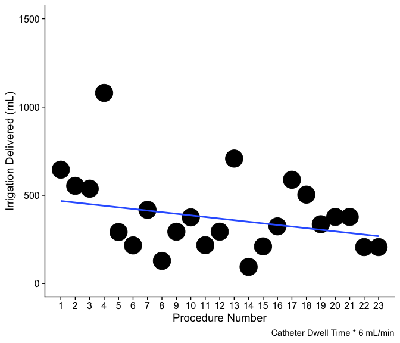

# Start with a clean slate


# Import - Point to the correct raw data directory


## load Subject Data


# Descriptive Statistics

Analysis Plan:
- histoplots of continuous variables - as of 7/30/24 this was useless to do, shows nothing at all due to small sample
- loess plots of continuous variables; x-axis is each procedure aligned in termporal order
- box plots
- we do procedure time vs rove time "proc_vs_rove" 

Hypotheses:

1) rove_per_app and rove_vs_proc with x axis as patient number to hopefully show a decreasing trend for both; i.e., you can 
  do lots of applications in a short period of time & ablation time is small relative to procedure time as the physician
  becomes more comfortable with our system
  
## The numbers

<div class="kable-table">

| mean_abl_min| sd_abl_min| mean_irrigation| sd_irrigation|
|------------:|----------:|---------------:|-------------:|
|       36.865|   17.48026|        384.3333|      170.2548|

</div>
```{=html}
<div id="hbdkksynqu" style="padding-left:0px;padding-right:0px;padding-top:10px;padding-bottom:10px;overflow-x:auto;overflow-y:auto;width:auto;height:auto;">
<style>#hbdkksynqu table {
  font-family: system-ui, 'Segoe UI', Roboto, Helvetica, Arial, sans-serif, 'Apple Color Emoji', 'Segoe UI Emoji', 'Segoe UI Symbol', 'Noto Color Emoji';
  -webkit-font-smoothing: antialiased;
  -moz-osx-font-smoothing: grayscale;
}

#hbdkksynqu thead, #hbdkksynqu tbody, #hbdkksynqu tfoot, #hbdkksynqu tr, #hbdkksynqu td, #hbdkksynqu th {
  border-style: none;
}

#hbdkksynqu p {
  margin: 0;
  padding: 0;
}

#hbdkksynqu .gt_table {
  display: table;
  border-collapse: collapse;
  line-height: normal;
  margin-left: auto;
  margin-right: auto;
  color: #333333;
  font-size: 16px;
  font-weight: normal;
  font-style: normal;
  background-color: #FFFFFF;
  width: auto;
  border-top-style: solid;
  border-top-width: 2px;
  border-top-color: #A8A8A8;
  border-right-style: none;
  border-right-width: 2px;
  border-right-color: #D3D3D3;
  border-bottom-style: solid;
  border-bottom-width: 2px;
  border-bottom-color: #A8A8A8;
  border-left-style: none;
  border-left-width: 2px;
  border-left-color: #D3D3D3;
}

#hbdkksynqu .gt_caption {
  padding-top: 4px;
  padding-bottom: 4px;
}

#hbdkksynqu .gt_title {
  color: #333333;
  font-size: 125%;
  font-weight: initial;
  padding-top: 4px;
  padding-bottom: 4px;
  padding-left: 5px;
  padding-right: 5px;
  border-bottom-color: #FFFFFF;
  border-bottom-width: 0;
}

#hbdkksynqu .gt_subtitle {
  color: #333333;
  font-size: 85%;
  font-weight: initial;
  padding-top: 3px;
  padding-bottom: 5px;
  padding-left: 5px;
  padding-right: 5px;
  border-top-color: #FFFFFF;
  border-top-width: 0;
}

#hbdkksynqu .gt_heading {
  background-color: #FFFFFF;
  text-align: center;
  border-bottom-color: #FFFFFF;
  border-left-style: none;
  border-left-width: 1px;
  border-left-color: #D3D3D3;
  border-right-style: none;
  border-right-width: 1px;
  border-right-color: #D3D3D3;
}

#hbdkksynqu .gt_bottom_border {
  border-bottom-style: solid;
  border-bottom-width: 2px;
  border-bottom-color: #D3D3D3;
}

#hbdkksynqu .gt_col_headings {
  border-top-style: solid;
  border-top-width: 2px;
  border-top-color: #D3D3D3;
  border-bottom-style: solid;
  border-bottom-width: 2px;
  border-bottom-color: #D3D3D3;
  border-left-style: none;
  border-left-width: 1px;
  border-left-color: #D3D3D3;
  border-right-style: none;
  border-right-width: 1px;
  border-right-color: #D3D3D3;
}

#hbdkksynqu .gt_col_heading {
  color: #333333;
  background-color: #FFFFFF;
  font-size: 100%;
  font-weight: normal;
  text-transform: inherit;
  border-left-style: none;
  border-left-width: 1px;
  border-left-color: #D3D3D3;
  border-right-style: none;
  border-right-width: 1px;
  border-right-color: #D3D3D3;
  vertical-align: bottom;
  padding-top: 5px;
  padding-bottom: 6px;
  padding-left: 5px;
  padding-right: 5px;
  overflow-x: hidden;
}

#hbdkksynqu .gt_column_spanner_outer {
  color: #333333;
  background-color: #FFFFFF;
  font-size: 100%;
  font-weight: normal;
  text-transform: inherit;
  padding-top: 0;
  padding-bottom: 0;
  padding-left: 4px;
  padding-right: 4px;
}

#hbdkksynqu .gt_column_spanner_outer:first-child {
  padding-left: 0;
}

#hbdkksynqu .gt_column_spanner_outer:last-child {
  padding-right: 0;
}

#hbdkksynqu .gt_column_spanner {
  border-bottom-style: solid;
  border-bottom-width: 2px;
  border-bottom-color: #D3D3D3;
  vertical-align: bottom;
  padding-top: 5px;
  padding-bottom: 5px;
  overflow-x: hidden;
  display: inline-block;
  width: 100%;
}

#hbdkksynqu .gt_spanner_row {
  border-bottom-style: hidden;
}

#hbdkksynqu .gt_group_heading {
  padding-top: 8px;
  padding-bottom: 8px;
  padding-left: 5px;
  padding-right: 5px;
  color: #333333;
  background-color: #FFFFFF;
  font-size: 100%;
  font-weight: initial;
  text-transform: inherit;
  border-top-style: solid;
  border-top-width: 2px;
  border-top-color: #D3D3D3;
  border-bottom-style: solid;
  border-bottom-width: 2px;
  border-bottom-color: #D3D3D3;
  border-left-style: none;
  border-left-width: 1px;
  border-left-color: #D3D3D3;
  border-right-style: none;
  border-right-width: 1px;
  border-right-color: #D3D3D3;
  vertical-align: middle;
  text-align: left;
}

#hbdkksynqu .gt_empty_group_heading {
  padding: 0.5px;
  color: #333333;
  background-color: #FFFFFF;
  font-size: 100%;
  font-weight: initial;
  border-top-style: solid;
  border-top-width: 2px;
  border-top-color: #D3D3D3;
  border-bottom-style: solid;
  border-bottom-width: 2px;
  border-bottom-color: #D3D3D3;
  vertical-align: middle;
}

#hbdkksynqu .gt_from_md > :first-child {
  margin-top: 0;
}

#hbdkksynqu .gt_from_md > :last-child {
  margin-bottom: 0;
}

#hbdkksynqu .gt_row {
  padding-top: 8px;
  padding-bottom: 8px;
  padding-left: 5px;
  padding-right: 5px;
  margin: 10px;
  border-top-style: solid;
  border-top-width: 1px;
  border-top-color: #D3D3D3;
  border-left-style: none;
  border-left-width: 1px;
  border-left-color: #D3D3D3;
  border-right-style: none;
  border-right-width: 1px;
  border-right-color: #D3D3D3;
  vertical-align: middle;
  overflow-x: hidden;
}

#hbdkksynqu .gt_stub {
  color: #333333;
  background-color: #FFFFFF;
  font-size: 100%;
  font-weight: initial;
  text-transform: inherit;
  border-right-style: solid;
  border-right-width: 2px;
  border-right-color: #D3D3D3;
  padding-left: 5px;
  padding-right: 5px;
}

#hbdkksynqu .gt_stub_row_group {
  color: #333333;
  background-color: #FFFFFF;
  font-size: 100%;
  font-weight: initial;
  text-transform: inherit;
  border-right-style: solid;
  border-right-width: 2px;
  border-right-color: #D3D3D3;
  padding-left: 5px;
  padding-right: 5px;
  vertical-align: top;
}

#hbdkksynqu .gt_row_group_first td {
  border-top-width: 2px;
}

#hbdkksynqu .gt_row_group_first th {
  border-top-width: 2px;
}

#hbdkksynqu .gt_summary_row {
  color: #333333;
  background-color: #FFFFFF;
  text-transform: inherit;
  padding-top: 8px;
  padding-bottom: 8px;
  padding-left: 5px;
  padding-right: 5px;
}

#hbdkksynqu .gt_first_summary_row {
  border-top-style: solid;
  border-top-color: #D3D3D3;
}

#hbdkksynqu .gt_first_summary_row.thick {
  border-top-width: 2px;
}

#hbdkksynqu .gt_last_summary_row {
  padding-top: 8px;
  padding-bottom: 8px;
  padding-left: 5px;
  padding-right: 5px;
  border-bottom-style: solid;
  border-bottom-width: 2px;
  border-bottom-color: #D3D3D3;
}

#hbdkksynqu .gt_grand_summary_row {
  color: #333333;
  background-color: #FFFFFF;
  text-transform: inherit;
  padding-top: 8px;
  padding-bottom: 8px;
  padding-left: 5px;
  padding-right: 5px;
}

#hbdkksynqu .gt_first_grand_summary_row {
  padding-top: 8px;
  padding-bottom: 8px;
  padding-left: 5px;
  padding-right: 5px;
  border-top-style: double;
  border-top-width: 6px;
  border-top-color: #D3D3D3;
}

#hbdkksynqu .gt_last_grand_summary_row_top {
  padding-top: 8px;
  padding-bottom: 8px;
  padding-left: 5px;
  padding-right: 5px;
  border-bottom-style: double;
  border-bottom-width: 6px;
  border-bottom-color: #D3D3D3;
}

#hbdkksynqu .gt_striped {
  background-color: rgba(128, 128, 128, 0.05);
}

#hbdkksynqu .gt_table_body {
  border-top-style: solid;
  border-top-width: 2px;
  border-top-color: #D3D3D3;
  border-bottom-style: solid;
  border-bottom-width: 2px;
  border-bottom-color: #D3D3D3;
}

#hbdkksynqu .gt_footnotes {
  color: #333333;
  background-color: #FFFFFF;
  border-bottom-style: none;
  border-bottom-width: 2px;
  border-bottom-color: #D3D3D3;
  border-left-style: none;
  border-left-width: 2px;
  border-left-color: #D3D3D3;
  border-right-style: none;
  border-right-width: 2px;
  border-right-color: #D3D3D3;
}

#hbdkksynqu .gt_footnote {
  margin: 0px;
  font-size: 90%;
  padding-top: 4px;
  padding-bottom: 4px;
  padding-left: 5px;
  padding-right: 5px;
}

#hbdkksynqu .gt_sourcenotes {
  color: #333333;
  background-color: #FFFFFF;
  border-bottom-style: none;
  border-bottom-width: 2px;
  border-bottom-color: #D3D3D3;
  border-left-style: none;
  border-left-width: 2px;
  border-left-color: #D3D3D3;
  border-right-style: none;
  border-right-width: 2px;
  border-right-color: #D3D3D3;
}

#hbdkksynqu .gt_sourcenote {
  font-size: 90%;
  padding-top: 4px;
  padding-bottom: 4px;
  padding-left: 5px;
  padding-right: 5px;
}

#hbdkksynqu .gt_left {
  text-align: left;
}

#hbdkksynqu .gt_center {
  text-align: center;
}

#hbdkksynqu .gt_right {
  text-align: right;
  font-variant-numeric: tabular-nums;
}

#hbdkksynqu .gt_font_normal {
  font-weight: normal;
}

#hbdkksynqu .gt_font_bold {
  font-weight: bold;
}

#hbdkksynqu .gt_font_italic {
  font-style: italic;
}

#hbdkksynqu .gt_super {
  font-size: 65%;
}

#hbdkksynqu .gt_footnote_marks {
  font-size: 75%;
  vertical-align: 0.4em;
  position: initial;
}

#hbdkksynqu .gt_asterisk {
  font-size: 100%;
  vertical-align: 0;
}

#hbdkksynqu .gt_indent_1 {
  text-indent: 5px;
}

#hbdkksynqu .gt_indent_2 {
  text-indent: 10px;
}

#hbdkksynqu .gt_indent_3 {
  text-indent: 15px;
}

#hbdkksynqu .gt_indent_4 {
  text-indent: 20px;
}

#hbdkksynqu .gt_indent_5 {
  text-indent: 25px;
}

#hbdkksynqu .katex-display {
  display: inline-flex !important;
  margin-bottom: 0.75em !important;
}

#hbdkksynqu div.Reactable > div.rt-table > div.rt-thead > div.rt-tr.rt-tr-group-header > div.rt-th-group:after {
  height: 0px !important;
}
</style>
<table class="gt_table" data-quarto-disable-processing="false" data-quarto-bootstrap="false">
  <thead>
    <tr class="gt_col_headings">
      <th class="gt_col_heading gt_columns_bottom_border gt_left" rowspan="1" colspan="1" scope="col" id="&lt;span class='gt_from_md'&gt;&lt;strong&gt;Characteristic&lt;/strong&gt;&lt;/span&gt;"><span class='gt_from_md'><strong>Characteristic</strong></span></th>
      <th class="gt_col_heading gt_columns_bottom_border gt_center" rowspan="1" colspan="1" scope="col" id="&lt;span class='gt_from_md'&gt;&lt;strong&gt;N&lt;/strong&gt;&lt;/span&gt;"><span class='gt_from_md'><strong>N</strong></span></th>
      <th class="gt_col_heading gt_columns_bottom_border gt_center" rowspan="1" colspan="1" scope="col" id="&lt;span class='gt_from_md'&gt;&lt;strong&gt;N = 16&lt;/strong&gt;&lt;/span&gt;&lt;span class=&quot;gt_footnote_marks&quot; style=&quot;white-space:nowrap;font-style:italic;font-weight:normal;line-height: 0;&quot;&gt;&lt;sup&gt;1&lt;/sup&gt;&lt;/span&gt;"><span class='gt_from_md'><strong>N = 16</strong></span><span class="gt_footnote_marks" style="white-space:nowrap;font-style:italic;font-weight:normal;line-height: 0;"><sup>1</sup></span></th>
    </tr>
  </thead>
  <tbody class="gt_table_body">
    <tr><td headers="label" class="gt_row gt_left">rove_time</td>
<td headers="n" class="gt_row gt_center">16</td>
<td headers="stat_0" class="gt_row gt_center"><br /></td></tr>
    <tr><td headers="label" class="gt_row gt_left">    Mean (SD)</td>
<td headers="n" class="gt_row gt_center"><br /></td>
<td headers="stat_0" class="gt_row gt_center">2,212 (1,049)</td></tr>
    <tr><td headers="label" class="gt_row gt_left">    Median (Q1-Q3)</td>
<td headers="n" class="gt_row gt_center"><br /></td>
<td headers="stat_0" class="gt_row gt_center">2,123 (1,606-2,805)</td></tr>
    <tr><td headers="label" class="gt_row gt_left">    Min, Max</td>
<td headers="n" class="gt_row gt_center"><br /></td>
<td headers="stat_0" class="gt_row gt_center">463, 3,965</td></tr>
    <tr><td headers="label" class="gt_row gt_left">num_applications</td>
<td headers="n" class="gt_row gt_center">16</td>
<td headers="stat_0" class="gt_row gt_center"><br /></td></tr>
    <tr><td headers="label" class="gt_row gt_left">    Mean (SD)</td>
<td headers="n" class="gt_row gt_center"><br /></td>
<td headers="stat_0" class="gt_row gt_center">98 (42)</td></tr>
    <tr><td headers="label" class="gt_row gt_left">    Median (Q1-Q3)</td>
<td headers="n" class="gt_row gt_center"><br /></td>
<td headers="stat_0" class="gt_row gt_center">99 (76-128)</td></tr>
    <tr><td headers="label" class="gt_row gt_left">    Min, Max</td>
<td headers="n" class="gt_row gt_center"><br /></td>
<td headers="stat_0" class="gt_row gt_center">31, 165</td></tr>
    <tr><td headers="label" class="gt_row gt_left">dwell_time</td>
<td headers="n" class="gt_row gt_center">9</td>
<td headers="stat_0" class="gt_row gt_center"><br /></td></tr>
    <tr><td headers="label" class="gt_row gt_left">    Mean (SD)</td>
<td headers="n" class="gt_row gt_center"><br /></td>
<td headers="stat_0" class="gt_row gt_center">3,843 (1,703)</td></tr>
    <tr><td headers="label" class="gt_row gt_left">    Median (Q1-Q3)</td>
<td headers="n" class="gt_row gt_center"><br /></td>
<td headers="stat_0" class="gt_row gt_center">3,752 (2,919-5,374)</td></tr>
    <tr><td headers="label" class="gt_row gt_left">    Min, Max</td>
<td headers="n" class="gt_row gt_center"><br /></td>
<td headers="stat_0" class="gt_row gt_center">1,284, 6,452</td></tr>
    <tr><td headers="label" class="gt_row gt_left">    Unknown</td>
<td headers="n" class="gt_row gt_center"><br /></td>
<td headers="stat_0" class="gt_row gt_center">7</td></tr>
    <tr><td headers="label" class="gt_row gt_left">etiology</td>
<td headers="n" class="gt_row gt_center">16</td>
<td headers="stat_0" class="gt_row gt_center"><br /></td></tr>
    <tr><td headers="label" class="gt_row gt_left">    ischemic</td>
<td headers="n" class="gt_row gt_center"><br /></td>
<td headers="stat_0" class="gt_row gt_center">15 (94%)</td></tr>
    <tr><td headers="label" class="gt_row gt_left">    non-ischemic</td>
<td headers="n" class="gt_row gt_center"><br /></td>
<td headers="stat_0" class="gt_row gt_center">1 (6.3%)</td></tr>
    <tr><td headers="label" class="gt_row gt_left">therapy</td>
<td headers="n" class="gt_row gt_center">16</td>
<td headers="stat_0" class="gt_row gt_center"><br /></td></tr>
    <tr><td headers="label" class="gt_row gt_left">    15kv_20x5_uni</td>
<td headers="n" class="gt_row gt_center"><br /></td>
<td headers="stat_0" class="gt_row gt_center">6 (38%)</td></tr>
    <tr><td headers="label" class="gt_row gt_left">    15kv_3x12_uni</td>
<td headers="n" class="gt_row gt_center"><br /></td>
<td headers="stat_0" class="gt_row gt_center">10 (63%)</td></tr>
    <tr><td headers="label" class="gt_row gt_left">rove_time_min</td>
<td headers="n" class="gt_row gt_center">16</td>
<td headers="stat_0" class="gt_row gt_center"><br /></td></tr>
    <tr><td headers="label" class="gt_row gt_left">    Mean (SD)</td>
<td headers="n" class="gt_row gt_center"><br /></td>
<td headers="stat_0" class="gt_row gt_center">37 (17)</td></tr>
    <tr><td headers="label" class="gt_row gt_left">    Median (Q1-Q3)</td>
<td headers="n" class="gt_row gt_center"><br /></td>
<td headers="stat_0" class="gt_row gt_center">35 (27-47)</td></tr>
    <tr><td headers="label" class="gt_row gt_left">    Min, Max</td>
<td headers="n" class="gt_row gt_center"><br /></td>
<td headers="stat_0" class="gt_row gt_center">8, 66</td></tr>
    <tr><td headers="label" class="gt_row gt_left">app_per_rove</td>
<td headers="n" class="gt_row gt_center">16</td>
<td headers="stat_0" class="gt_row gt_center"><br /></td></tr>
    <tr><td headers="label" class="gt_row gt_left">    Mean (SD)</td>
<td headers="n" class="gt_row gt_center"><br /></td>
<td headers="stat_0" class="gt_row gt_center">2.87 (0.76)</td></tr>
    <tr><td headers="label" class="gt_row gt_left">    Median (Q1-Q3)</td>
<td headers="n" class="gt_row gt_center"><br /></td>
<td headers="stat_0" class="gt_row gt_center">2.66 (2.35-3.62)</td></tr>
    <tr><td headers="label" class="gt_row gt_left">    Min, Max</td>
<td headers="n" class="gt_row gt_center"><br /></td>
<td headers="stat_0" class="gt_row gt_center">1.65, 4.02</td></tr>
    <tr><td headers="label" class="gt_row gt_left">irrigation_delivered</td>
<td headers="n" class="gt_row gt_center">9</td>
<td headers="stat_0" class="gt_row gt_center"><br /></td></tr>
    <tr><td headers="label" class="gt_row gt_left">    Mean (SD)</td>
<td headers="n" class="gt_row gt_center"><br /></td>
<td headers="stat_0" class="gt_row gt_center">384 (170)</td></tr>
    <tr><td headers="label" class="gt_row gt_left">    Median (Q1-Q3)</td>
<td headers="n" class="gt_row gt_center"><br /></td>
<td headers="stat_0" class="gt_row gt_center">375 (292-537)</td></tr>
    <tr><td headers="label" class="gt_row gt_left">    Min, Max</td>
<td headers="n" class="gt_row gt_center"><br /></td>
<td headers="stat_0" class="gt_row gt_center">128, 645</td></tr>
    <tr><td headers="label" class="gt_row gt_left">    Unknown</td>
<td headers="n" class="gt_row gt_center"><br /></td>
<td headers="stat_0" class="gt_row gt_center">7</td></tr>
  </tbody>
  
  <tfoot class="gt_footnotes">
    <tr>
      <td class="gt_footnote" colspan="3"><span class="gt_footnote_marks" style="white-space:nowrap;font-style:italic;font-weight:normal;line-height: 0;"><sup>1</sup></span> <span class='gt_from_md'>n (%)</span></td>
    </tr>
  </tfoot>
</table>
</div>
```


### Make Mapping Data

Make temporary mapping data.


## Irrigation Delivered

#### Line Plot

<!-- -->

#### Box Plots

<!-- -->

## Ablation Time

#### Line Plot

<!-- -->

#### Box Plots

<!-- -->

# Save Results

# Version and Package Details


```
## [1] "R version 4.4.0 (2024-04-24) Puppy Cup"
```

```
## [1] "RStudio Version 2024.4.2.764 Chocolate Cosmos"
```

<div class="kable-table">

|          |package   |loadedversion |
|:---------|:---------|:-------------|
|cowplot   |cowplot   |1.1.3         |
|dplyr     |dplyr     |1.1.4         |
|ggplot2   |ggplot2   |3.5.1         |
|gtsummary |gtsummary |2.0.1         |

</div>

# Detach Packages before moving on


```
## Warning: 'dplyr' namespace cannot be unloaded:
##   namespace 'dplyr' is imported by 'cards', 'gtsummary', 'tidyr', 'gt' so cannot be unloaded
```

# When were these files last rewritten?


```
## [1] "Wed Nov 27 23:03:13 2024"
```
